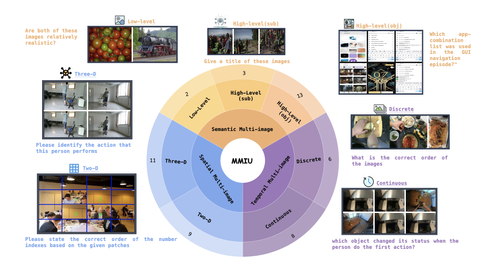
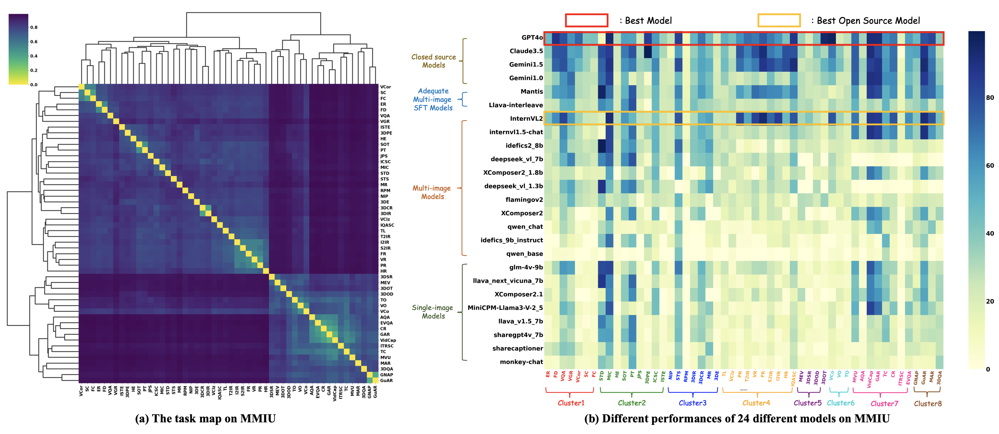

# Best Practice

**We strongly recommend using [VLMEevalKit](https://github.com/open-compass/VLMEvalKit) for its useful features and ready-to-use LVLM implementations**.

# MMIU

  <a href="https://mmiu-bench.github.io/"><b>HomePage</b></a> |
  <a href="#🖊️-citation"><b>Citation</b></a>  

This repository is the official implementation of [MMIU](https://arxiv.org/abs/2408.02718). 

> [MMIU: Multimodal Multi-image Understanding for Evaluating Large Vision-Language Models](https://arxiv.org/abs/2408.02718)  
> Fanqing Meng\*, Jin Wang\*, Chuanhao Li\*, Quanfeng Lu, Hao Tian, Jiaqi Liao, Xizhou Zhu, Jifeng Dai,  Yu Qiao, Ping Luo, Kaipeng Zhang\#, Wenqi Shao\#  
> \* MFQ, WJ and LCH contribute equally.  
> \# SWQ (shaowenqi@pjlab.org.cn) and ZKP (zhangkaipeng@pjlab.org.cn) are correponding authors. 

## 💡 News

- `2024/08/05`: The datasets and codes are coming soon! 🔥🔥🔥

- `2024/08/05`: The technical report of [MMIU](https://arxiv.org/abs/2408.02718) is released! And check our [project page](https://mmiu-bench.github.io/)! 🔥🔥🔥

## Introduction
Multimodal Multi-image Understanding (MMIU) benchmark, a comprehensive evaluation suite designed to assess LVLMs across a wide range of multi-image tasks. MMIU encompasses 7 types of multi-image relationships, 52 tasks, 77K images, and 11K meticulously curated multiple-choice questions, making it the most extensive benchmark of its kind. 

## Evaluation Results Overview
- The closed-source proprietary model GPT-4o from OpenAI has taken a leading position in MMIU, surpassing other models such as InternVL2-pro, InternVL1.5-chat, Claude3.5-Sonnet, and Gemini1.5 flash. Note that the open-source models InternVL2-pro.

- Some powerful LVLMs like InternVL1.5  and  GLM4V whose pre-training data do not contain multi-image content even outperform many multi-image models which undergo multi-image supervised fine-tuning (SFT), indicating the strong capacity in single-image understanding is the foundation of multi-image comprehension.
- By comparing performance at the level of image relationships, we conclude that LVLM excels at understanding semantic content in multi-image scenarios but has weaker performance in comprehending temporal and spatial relationships in multi-image contexts.
- The analysis based on the task map reveals that models perform better on high-level understanding tasks such as video captioning which are in-domain tasks, but struggle with 3D perception tasks such as 3D detection and temporal reasoning tasks such as image ordering which are out-of-domain tasks.
- By task learning difficulty analysis, tasks involving ordering, retrieval and massive images cannot be overfitted by simple SFT, suggesting that additional pre-training data or training techniques should be incorporated for improvement.

## 🏆 Leaderboard

| Rank | Model | Score |
| ---- | ---------------------- | ----- |
| **1** | **GPT4o** | **55.72** |
| 2 | Gemini | 53.41 |
| 3 | Claude3 | 53.38 |
| **4** | **InternVL2** | **50.30** |
| 5 | Mantis | 45.58 |
| 6 | Gemini1.0 | 40.25 |
| 7 | internvl1.5-chat | 37.39 |
| 8 | Llava-interleave | 32.37 |
| 9 | idefics2_8b | 27.80 |
| 10 | glm-4v-9b | 27.02 |
| 11 | deepseek_vl_7b | 24.64 |
| 12 | XComposer2_1.8b | 23.46 |
| 13 | deepseek_vl_1.3b | 23.21 |
| 14 | flamingov2 | 22.26 |
| 15 | llava_next_vicuna_7b | 22.25 |
| 16 | XComposer2 | 21.91 |
| 17 | MiniCPM-Llama3-V-2_5 | 21.61 |
| 18 | llava_v1.5_7b | 19.19 |
| 19 | sharegpt4v_7b | 18.52 |
| 20 | sharecaptioner | 16.10 |
| 21 | qwen_chat | 15.92 |
| 22 | monkey-chat | 13.74 |
| 23 | idefics_9b_instruct | 12.84 |
| 24 | qwen_base | 5.16 |
| -   | Frequency Guess        | 31.5  |
| -   | Random Guess           | 27.4  |

## 💐 Acknowledgement

We expressed sincerely gratitude for the projects listed following:
- [VLMEvalKit](https://github.com/open-compass/VLMEvalKit) provides useful out-of-box tools and implements many adavanced LVLMs. Thanks for their selfless dedication.
- The Team of InternVL for apis.

## 📧 Contact
If you have any questions, feel free to contact Fanqing Meng with mengfanqing33@gmail.com

## 🖊️ Citation 
If you feel MMIU useful in your project or research, please kindly use the following BibTeX entry to cite our paper. Thanks!

